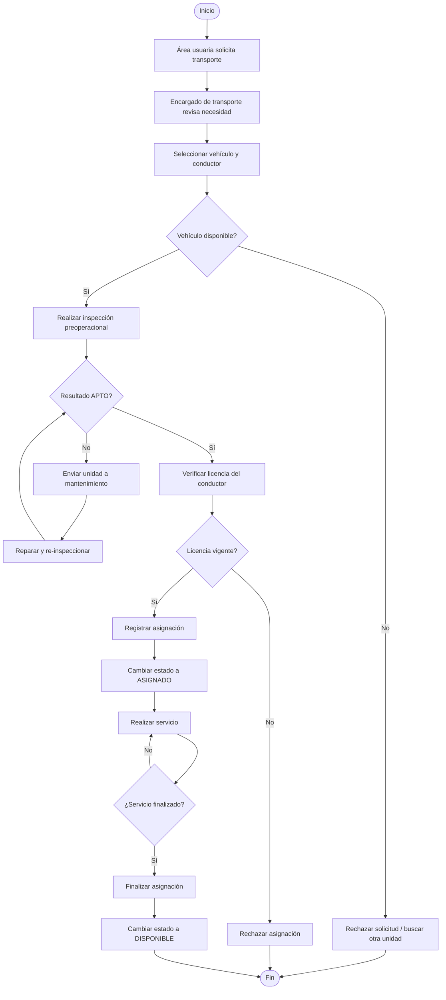

# Diagrama de actividades — servicio de transporte

```mermaid
flowchart TD
    A([Inicio]) --> B[Área usuaria solicita transporte]
    B --> C[Encargado de transporte revisa necesidad]
    C --> D[Seleccionar vehículo y conductor]
    D --> E{Vehículo disponible?}
    E -- No --> F[Rechazar solicitud / buscar otra unidad]
    F --> Z([Fin])
    E -- Sí --> G[Realizar inspección preoperacional]
    G --> H{Resultado APTO?}
    H -- No --> I[Enviar unidad a mantenimiento]
    I --> J[Reparar y re-inspeccionar]
    J --> H
    H -- Sí --> K[Verificar licencia del conductor]
    K --> L{Licencia vigente?}
    L -- No --> M[Rechazar asignación]
    M --> Z
    L -- Sí --> N[Registrar asignación]
    N --> O[Cambiar estado a ASIGNADO]
    O --> P[Realizar servicio]
    P --> Q{¿Servicio finalizado?}
    Q -- No --> P
    Q -- Sí --> R[Finalizar asignación]
    R --> S[Cambiar estado a DISPONIBLE]
    S --> Z([Fin])
```
