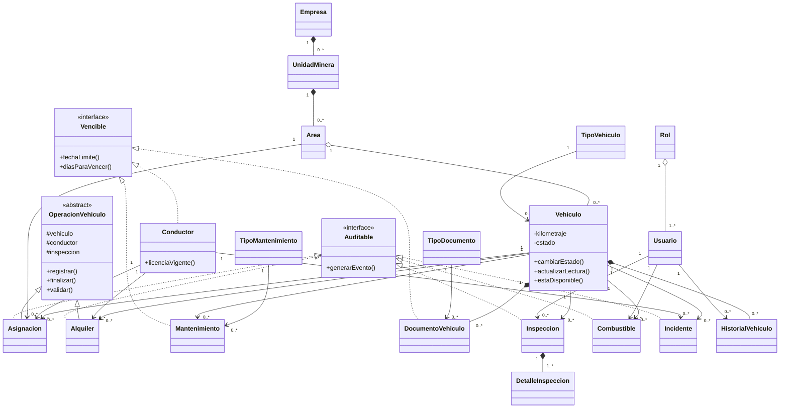

# Diagrama de clases — modelo completo

El modelo contiene 19 clases de dominio. `OperacionVehiculo` es una clase abstracta de diseño y `Auditable`/`Vencible` son interfaces de diseño.

### Leyenda

- `*--` composición: la parte depende del ciclo de vida del todo.
- `o--` agregación: la parte puede existir y reasignarse independientemente.
- `-->` asociación.
- `<|--` herencia.
- `<<interface>>` contrato de comportamiento.
