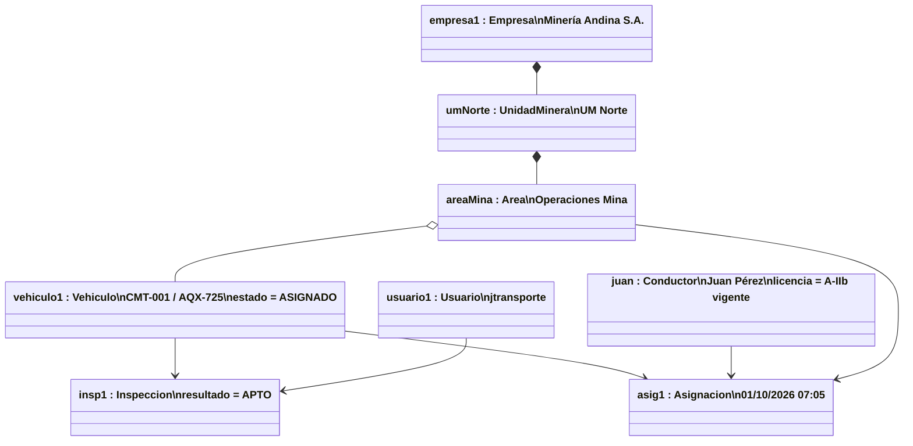

# Diagrama de objetos

Ejemplo del estado del sistema el 01/10/2026 a las 07:05.

```mermaid
classDiagram
    class empresa1["empresa1 : Empresa\nMinería Andina S.A."]
    class umNorte["umNorte : UnidadMinera\nUM Norte"]
    class areaMina["areaMina : Area\nOperaciones Mina"]
    class vehiculo1["vehiculo1 : Vehiculo\nCMT-001 / AQX-725\nestado = ASIGNADO"]
    class conductor1["juan : Conductor\nJuan Pérez\nlicencia = A-IIb vigente"]
    class insp1["insp1 : Inspeccion\nresultado = APTO"]
    class asign1["asig1 : Asignacion\n01/10/2026 07:05"]
    class usuario1["usuario1 : Usuario\njtransporte"]

    empresa1 *-- umNorte
    umNorte *-- areaMina
    areaMina o-- vehiculo1
    vehiculo1 --> insp1
    vehiculo1 --> asign1
    conductor1 --> asign1
    areaMina --> asign1
    usuario1 --> insp1
```
