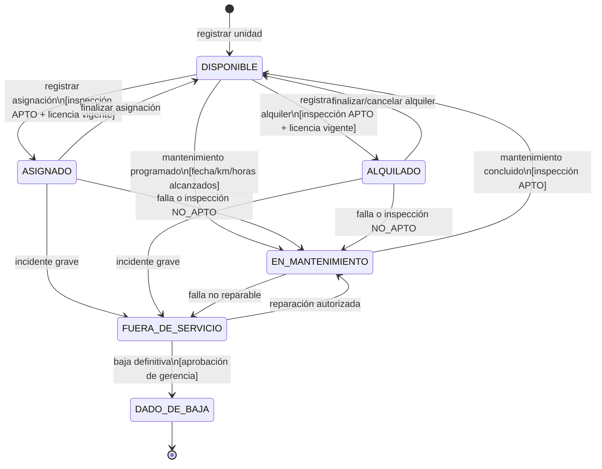

# Diagrama de estados del vehículo

```mermaid
stateDiagram-v2
    [*] --> DISPONIBLE : registrar unidad
    DISPONIBLE --> ASIGNADO : registrar asignación\n[inspección APTO + licencia vigente]
    DISPONIBLE --> ALQUILADO : registrar alquiler\n[inspección APTO + licencia vigente]
    ASIGNADO --> DISPONIBLE : finalizar asignación
    ALQUILADO --> DISPONIBLE : finalizar/cancelar alquiler
    DISPONIBLE --> EN_MANTENIMIENTO : mantenimiento programado\n[fecha/km/horas alcanzados]
    ASIGNADO --> EN_MANTENIMIENTO : falla o inspección NO_APTO
    ALQUILADO --> EN_MANTENIMIENTO : falla o inspección NO_APTO
    ASIGNADO --> FUERA_DE_SERVICIO : incidente grave
    ALQUILADO --> FUERA_DE_SERVICIO : incidente grave
    EN_MANTENIMIENTO --> DISPONIBLE : mantenimiento concluido\n[inspección APTO]
    EN_MANTENIMIENTO --> FUERA_DE_SERVICIO : falla no reparable
    FUERA_DE_SERVICIO --> EN_MANTENIMIENTO : reparación autorizada
    FUERA_DE_SERVICIO --> DADO_DE_BAJA : baja definitiva\n[aprobación de gerencia]
    DADO_DE_BAJA --> [*]
```
