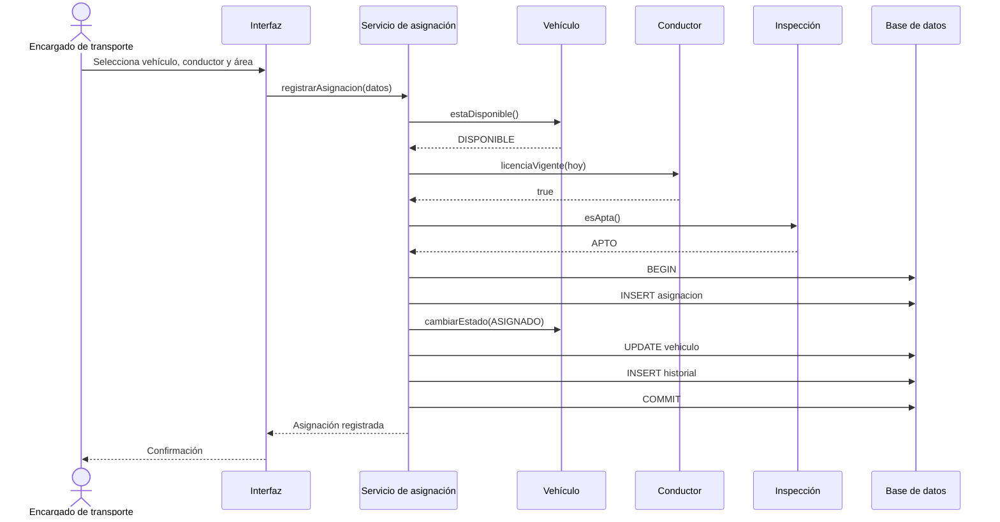

# Secuencia — CU-04 Registrar asignación

```mermaid
sequenceDiagram
    actor T as Encargado de transporte
    participant UI as Interfaz
    participant S as Servicio de asignación
    participant V as Vehículo
    participant C as Conductor
    participant I as Inspección
    participant DB as Base de datos

    T->>UI: Selecciona vehículo, conductor y área
    UI->>S: registrarAsignacion(datos)
    S->>V: estaDisponible()
    V-->>S: DISPONIBLE
    S->>C: licenciaVigente(hoy)
    C-->>S: true
    S->>I: esApta()
    I-->>S: APTO
    S->>DB: BEGIN
    S->>DB: INSERT asignacion
    S->>V: cambiarEstado(ASIGNADO)
    S->>DB: UPDATE vehiculo
    S->>DB: INSERT historial
    S->>DB: COMMIT
    S-->>UI: Asignación registrada
    UI-->>T: Confirmación
```
