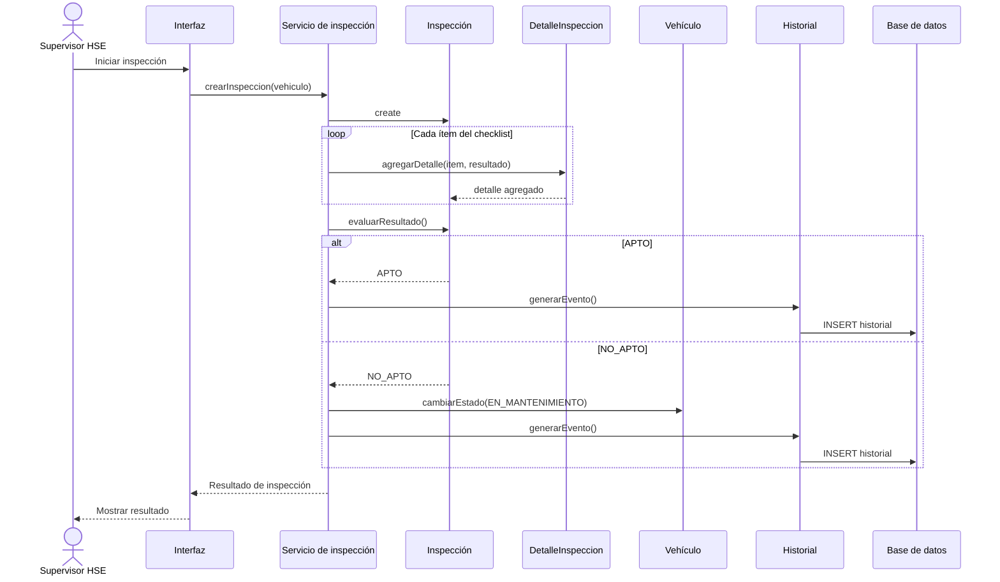

# Secuencia — CU-10 Registrar inspección preoperacional

```mermaid
sequenceDiagram
    actor H as Supervisor HSE
    participant UI as Interfaz
    participant S as Servicio de inspección
    participant I as Inspección
    participant D as DetalleInspeccion
    participant V as Vehículo
    participant HST as Historial
    participant DB as Base de datos

    H->>UI: Iniciar inspección
    UI->>S: crearInspeccion(vehiculo)
    S->>I: create
    loop Cada ítem del checklist
        S->>D: agregarDetalle(item, resultado)
        D-->>I: detalle agregado
    end
    S->>I: evaluarResultado()
    alt APTO
        I-->>S: APTO
        S->>HST: generarEvento()
        HST->>DB: INSERT historial
    else NO_APTO
        I-->>S: NO_APTO
        S->>V: cambiarEstado(EN_MANTENIMIENTO)
        S->>HST: generarEvento()
        HST->>DB: INSERT historial
    end
    S-->>UI: Resultado de inspección
    UI-->>H: Mostrar resultado
```
