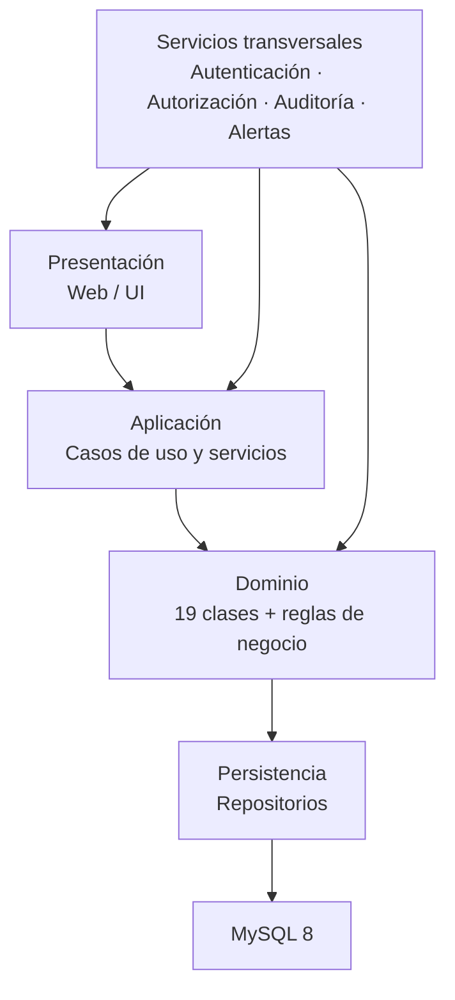

# Diagrama de paquetes

```mermaid
flowchart TB
    P["Presentación\nWeb / UI"] --> A["Aplicación\nCasos de uso y servicios"]
    A --> D["Dominio\n19 clases + reglas de negocio"]
    D --> R["Persistencia\nRepositorios"]
    R --> DB["MySQL 8"]
    X["Servicios transversales\nAutenticación · Autorización · Auditoría · Alertas"] --> P
    X --> A
    X --> D
```
