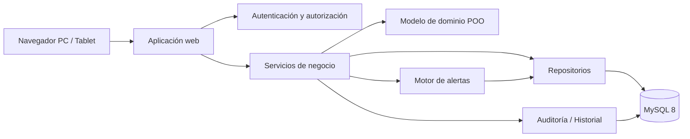

# Diagrama de componentes

```mermaid
flowchart LR
    Cliente["Navegador PC / Tablet"] --> Web["Aplicación web"]
    Web --> Auth["Autenticación y autorización"]
    Web --> Servicios["Servicios de negocio"]
    Servicios --> Dominio["Modelo de dominio POO"]
    Servicios --> Alertas["Motor de alertas"]
    Servicios --> Repo["Repositorios"]
    Alertas --> Repo
    Repo --> MySQL[("MySQL 8")]
    Servicios --> Auditoria["Auditoría / Historial"]
    Auditoria --> MySQL
```
