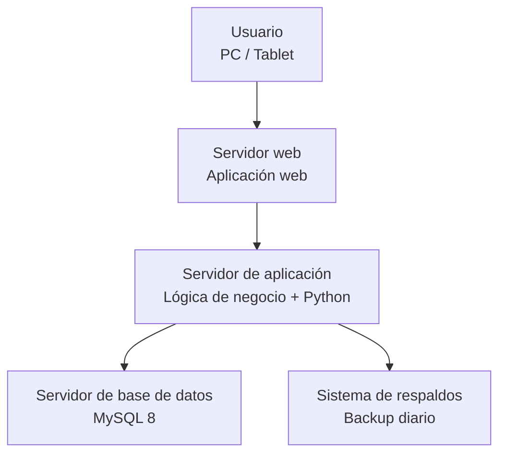

# Diagrama de despliegue

```mermaid
flowchart TB
    U["Usuario\nPC / Tablet"] --> WEB["Servidor web\nAplicación web"]
    WEB --> APP["Servidor de aplicación\nLógica de negocio + Python"]
    APP --> DB["Servidor de base de datos\nMySQL 8"]
    APP --> BK["Sistema de respaldos\nBackup diario"]
```
