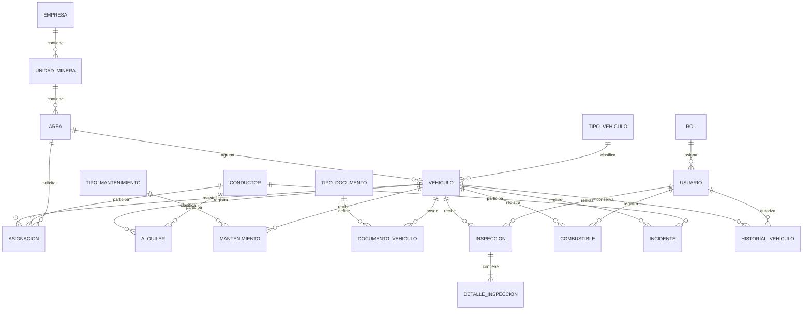

# Modelo de base de datos

```mermaid
erDiagram
    EMPRESA ||--o{ UNIDAD_MINERA : contiene
    UNIDAD_MINERA ||--o{ AREA : contiene
    AREA ||--o{ VEHICULO : agrupa
    TIPO_VEHICULO ||--o{ VEHICULO : clasifica
    VEHICULO ||--o{ ASIGNACION : registra
    VEHICULO ||--o{ ALQUILER : registra
    CONDUCTOR ||--o{ ASIGNACION : participa
    CONDUCTOR ||--o{ ALQUILER : participa
    AREA ||--o{ ASIGNACION : solicita
    TIPO_MANTENIMIENTO ||--o{ MANTENIMIENTO : clasifica
    VEHICULO ||--o{ MANTENIMIENTO : recibe
    TIPO_DOCUMENTO ||--o{ DOCUMENTO_VEHICULO : define
    VEHICULO ||--o{ DOCUMENTO_VEHICULO : posee
    VEHICULO ||--o{ INSPECCION : recibe
    INSPECCION ||--|{ DETALLE_INSPECCION : contiene
    VEHICULO ||--o{ COMBUSTIBLE : registra
    VEHICULO ||--o{ INCIDENTE : registra
    CONDUCTOR ||--o{ INCIDENTE : participa
    VEHICULO ||--o{ HISTORIAL_VEHICULO : conserva
    ROL ||--o{ USUARIO : asigna
    USUARIO ||--o{ INSPECCION : realiza
    USUARIO ||--o{ COMBUSTIBLE : registra
    USUARIO ||--o{ HISTORIAL_VEHICULO : autoriza
```
